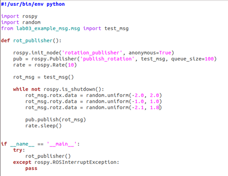
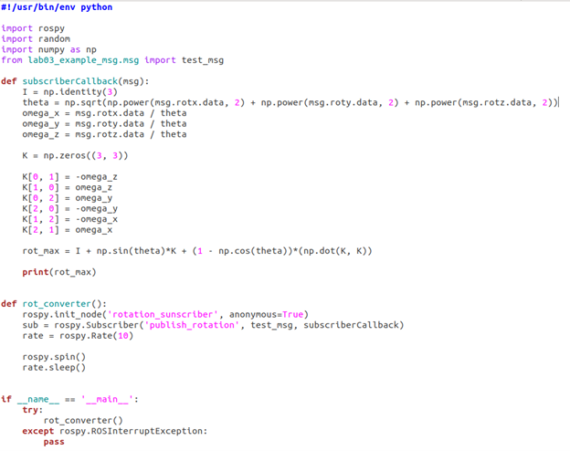
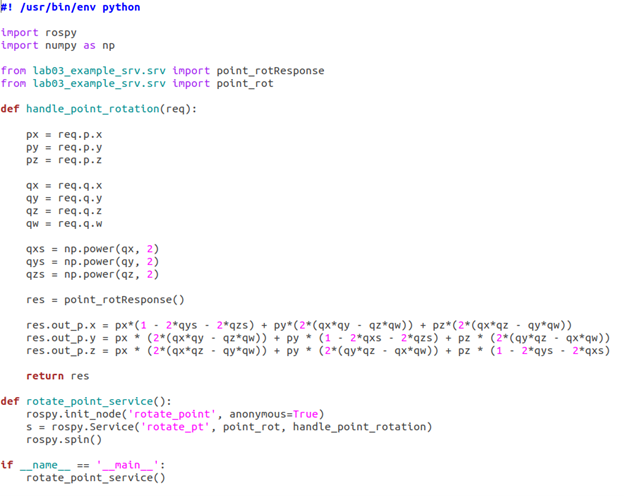
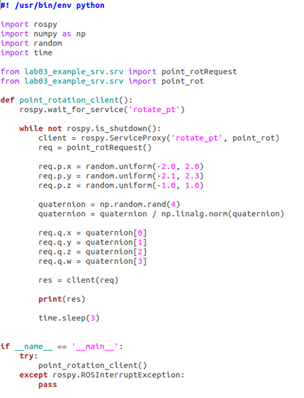

**COMP0127 Robotic Systems Engineering Lab 03**

**Module lead:** Dr. Agostino Stilli

**TA team:** Solène Dietsch, Katie Doyle, Aoife McDonald-Bowyer, Ziting
Liang 

This document contains examples and exercises on writing code for
customized ROS messages and ROS service-client communication. 

Navigate into the `comp0127_lab` folder inside your
workspace and run:

```
git pull
```

to update your repository with the current lab folder. Then you should
`catkin_make` the workspace and source the environment as you were
taught in Lab 01.


# Messages (msg) and services (srv)
A `msg` file is a simple text file that describes the fields of a ROS
message.

Similarly, an `srv` file describes a service. A service is composed of
two parts, a request and a response. A providing ROS node offers a
service under a string name, and a client calls the service by sending
the request message and awaiting the reply

Visit
<http://wiki.ros.org/ROS/Tutorials/CreatingMsgAndSrv#Introduction_to_msg_and_srv>
to take an extensive look on how `msg` and `srv` files are composed and
what field types are used.

# **Message Example**

In the same way as we did last time, let's make a new `lab03` folder
inside our `comp0127_lab` directory, and inside the `lab03` folder,
let's create a new package called `lab03_example`:

```
cd ~/catkin_ws/src/comp0127_lab
mkdir lab03
cd lab03
catkin_create_pkg lab03_example rospy std_msgs
```

We will navigate into that package folder and we will create a ROS
message.

```
cd ~/catkin_ws/src/comp0127/lab03/lab03_example
mkdir msg
echo int64 num > msg/Num.msg
```

Now navigate into the `msg` folder of the `lab03_example` package and
take a look at the message we just created. You can see that it is the
simplest of messages, containing just a line with a file type. You can
add more file types, always one per line.

Now that we have created our message, we need to turn it into source
code for Python etc.

In the `package.xml` file of the package, add the following lines.

```
cd ~/catkin_ws/src/comp0127/lab03/lab03_example
mkdir msg
echo int64 num > msg/Num.msg
```

And in the `CMakeLists.txt` file of the package, add the
`message_generation` line into your **existing** `find_package` text
field:
```
cd ~/catkin_ws/src/comp0127/lab03/lab03_example
mkdir msg
echo int64 num > msg/Num.msg
```

Also, in the same file add `CATKIN_DEPENS message_runtime` in the
**existing** `catkin_package` text field:

Next, add the following block of code into the file:
```
add_message_files(FILES  Num.msg)
```

This makes sure that CMake knows when it has to reconfigure the project
after you add other `.msg` files and it has to be placed before the
`generate_messages` command. And lastly make sure the lines below are
uncommented.

```
generate_messages(DEPENDENCIES  std_msgs)
```

To check if your message was created successfully, simply run the
following command, after you have run `catkin_make`. You should see
`int64 num`.
```
rosmsg show lab03_example/Num
```

# **Service Example**

Navigate into that package folder and we will create a ROS service.
```
cd ~/catkin_ws/src/comp0127/lab03/lab03_example
mkdir srv
```

Instead of creating a new `srv` definition by hand, we will copy an
existing one from another package. For that, roscp is a useful command
line tool for copying files from one package to another. Now we can copy
a service from the `rospy_tutorials` package:
```
roscp rospy_tutorials AddTwoInts.srv srv/AddTwoInts.srv
```

If you want to create the srv file from scratch, you can follow the same
step as creating a msg file, thus navigate into your srv folder and
type:

```
# Inside ~/catkin_ws/src/comp0127/lab03/lab03_example/srv
gedit AddTwoInts.srv 
```

The `gedit` command will create and open the requested file as a blank
txt file. Once open, copy and paste the following in your srv file:

```
int64 a
int64 b
---
int64 sum
```

Save and exit. Here we created a service that takes two floats as input
and returns a float as output.

Similarly, with before, we need to turn the `srv` file into source code.
Both the `package.xml` and `CMakeLists.txt` files need to contain
everything we added before in the \`Message Example`. Additionally, in
the `CMakeLists.txt` file we need to add before the `generate_messages`
command, this command:
```
add_service_files(FILES  AddTwoInts.srv)
```

To check if your message was created successfully simply run:
```
rossrv show lab03_example/AddTwoInts
```

And you should see:

```
int64 a
int64 b
---
int64 sum
```

Now that we made all these changes we should `catkin_make` our
environment once again.

# **Examples**

## **Message example**

Now we will produce a publisher/subscriber data stream where the
publisher sends 3 random floats corresponding to the Rodrigues angles of
a random rotation and the subscribers receives and transforms them into
a rotation matrix (that will be printed).

First, let's create a new package `lab03_example_msg`:
```
cd ~/catkin_ws/src/comp0127_lab/lab03
catkin_create_pkg lab03_example_msg rospy std_msgs
```

Now, following all the previous steps, we will create a msg folder with
a test_msg.msg file inside where we will type the following:

```
std_msgs/Float64 rotx
std_msgs/Float64 roty
std_msgs/Float64 rotz
```

This means that our message will contain 3 floats, namely rotx, roty,
rotz. Save and exit.\
After we have modified the package.xml and CMakeLists.txt files as we
did before, we can populate the `src` folder with the following two
scripts:

Publisher (lab03_example01_pub.py):



These two scripts are very similar to the ones we encountered in the
previous lab, however here we are not using a std_msg but a custom one.

In order to use custom messages in our publisher we have to:

-   Import them from the folder they were defined, in this case
    `lab03_example_msg.msg`

-   Create an empty message inside the script by calling the imported
    message:

**rot_msg = test_msg()**

-   Fill the message with the appropriate information. In this case we
    will fill each variable of our message with a random number using
    the `random` library.

Subscriber (lab03_example01_sub.py):



In the subscriber, we can easily access the message content by referring
to the variable`s name.

You can check the variables names inside the messages online. For
example, the Float64 message we used is part of std_msgs and can be
found here:

<http://docs.ros.org/en/noetic/api/std_msgs/html/msg/Float64.html>

As you can see, our message is composed by 3 Float64 messages, each one
containing 1 variable called `data`.

Thus, to store the rotx value of the received message msg into a
variable X, we will type:

X = msg.rotx.data

Most of the message components we will use can be found online.

Once this is done, we can save, exit, return to catkin_ws and catkin
make.

Again, it is better to create a launch file to launch everything instead
of opening 3 terminals for `roscore`, `publisher` and `subscriber`.

## **Service example**

In this Example, you will create a point rotation-by-quaternion service.

1.  When this service is requested, the requested point should be
    rotated in 3D space by the requested quaternion.

2.  Create a request node that generates a random point and a random
    quaternion and uses the service to request the rotation of the 3D
    point. Calculate and print the value of the computational time
    between the request and the response and print the appropriate point
    response.

For the task we will need to produce a client that will send a point and
a quaternion and a server that will take them and send back a rotated
point. For this reason, we will include `geometry_msgs` along with
`std_msgs` when creating our package. Geometry_msgs constains several
useful messages such as points and quaternions that will be widely used
during the course.

let's create a new package `lab03_example_srv` inside our
comp0127_lab/lab03 directory:

```
cd ~/catkin_ws/src/comp0127_lab/lab03
catkin_create_pkg lab03_example_srv rospy std_msgs geometry_msgs
```

Then let's create our srv folder with a `point_rot.srv` file inside
containing the following:

```
geometry_msgs/Quaternion q
geometry_msgs/Point p
---
geometry_msgs/Point out_p
```

Save, exit and repeat the steps to modify the package.xml and
CMakeLists.txt files.

Now we will fill the `src` folder with our `client.py` and `server.py`.

Starting from the service node:



-   First, import the srv file from the specified folder. You can see
    that we import two elements: point_rot and point_rotResponse. The
    first one has the same name of the service you created and it does
    define the service that will be used. The second has the same name
    as before expanded by adding `Response`. This will import a response
    message that has the same variables as the response part of our
    service, thus a point out_p.

-   In the `rotate_point_service` function we first initialize the node.
    Then we create the service using rospy.Service(). This function
    takes as first input the name of the service that will be created,
    the service defined in our srv file (second input), and the function
    that will be applied on the given request message (third input).

-   Rospy.spin() will maintain the service node alive until it is
    shutdown.

-   In the `handle_rotate_point` function, you can see that
    point_rotResponse is effectively a message and you can create and
    access it as we showed previously.



Moving to the client:

-   First, import the srv file from the specified folder. Here we import
    two elements again: point_rot and point_rotRequest. The first one
    has the same name of the service we created and it does define the
    service that will be used. The second has the same name as before
    expanded by adding `Request`. This will import a request message
    that has the same variables as the request part of our service, thus
    a Point p and a Quaternion q.

-   The service client is initialized using rospy.ServiceProxy(). This
    takes two elements: the name of the service (must be the same as the
    one defined in the service node) and the service definition

-   Once the client has been initialized, you can use it as a common
    python function, thus: request = client (request_message)

Once this is done, we can save, exit, return to catkin_ws and catkin
make. Rosrun/roslaunch to run your package.

# **Task**

Fill in the template to write a ROS service that converts a rotation
matrix R into a quaternion representation Q. Then, a ROS client to
randomly generate a rotation matrix, request the R2Quaternion service
and print the result.
